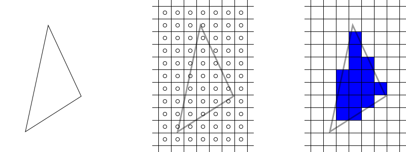
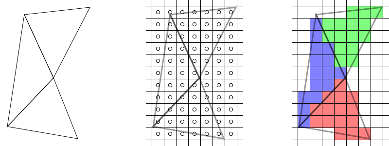
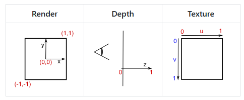
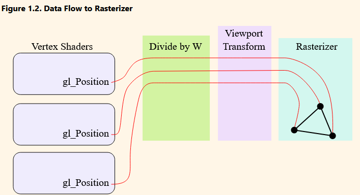

# Part I. The Basics

## Rasterization Overview

### Clip Space Transformation

Transforms the vertices into **clip space**, imagine holding up a camera and looking at the
display, some of the things will be _clipped_ out of the scene, even though they are physically
there, because the camera will only capture a certain size of things (it has a view volume). The
vertices now are said to have **clip coordinates** (`(x, y, z, w)`). `w` defines the extents
of the clip space for each _vertex_, so vertices with a different `w` are in different clip spaces
(different clip volumes, or cubes).

### Normalized Coordinates

Clip space has a different extent for each vertex, so to make things easier, `(x, y, z)` of each
vertex is divided by `w` to get normalized device coordinates. This is similar to clip space,
but with the limited extent of `[-1, 1]` for `(x, y, z)`, instead of `[-w, w]`.

### Window Transformation

This is the step that transforms into whatever your window (API) context is.

### Scan Conversion

Samples the pixels to check if it's inside the triangle (or object) and produces **fragments** for
every sample that is inside.





## OpenGL vs WGPU

**WGPU** uses _DirectX_ coordinate space, which is different from _OpenGL_.
Bottom left is `(-1, -1)`, top right `(1, 1)` and wgpu renders in **counter-clockwise** fashion (
my triangle rendering test showed that it did middle -> left -> right).

```rust
glam::const_vec3!([0.0, 0.9, 0.0]), // middle point
glam::const_vec3!([-0.9, -0.9, 0.0]), // left-most point
glam::const_vec3!([0.9, -0.9, 0.0]), // right-most point
```



## Rasterizer Data Flow



## Vertex Attributes

### Fragment Interpolation

A basic **vertex** shader for a **triangle** will run 3 times, producing 3 _color_ values to
feed the **fragment** shader. But the fragment shader runs for each produced fragment,
so for a `500x500` screen, with `250,000` pixels, if the triangle covers `1/10` of the screen,
then the fragment shader will run `25,000` times. This would makes no sense as there were only
3 output color values being produced by the vertex shader, but what actually happens is that
the implicit `smooth out vec4 out_color` does **fragment interpolation**, generating values
(blends) for each of `n` fragment shader runs. The `smooth` qualifier is the default, so no need
to explicitly use it
[glsl qualifiers](https://www.khronos.org/opengl/wiki/Type_Qualifier_(GLSL)#Interpolation_qualifiers).

- > Data passed from the vertex shader to the fragment shader is interpolated across the surface of
  > the triangle, based on the interpolation qualifier used for the output and input variables in
  > the vertex and fragment shaders respectively.
